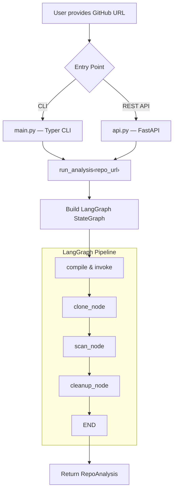
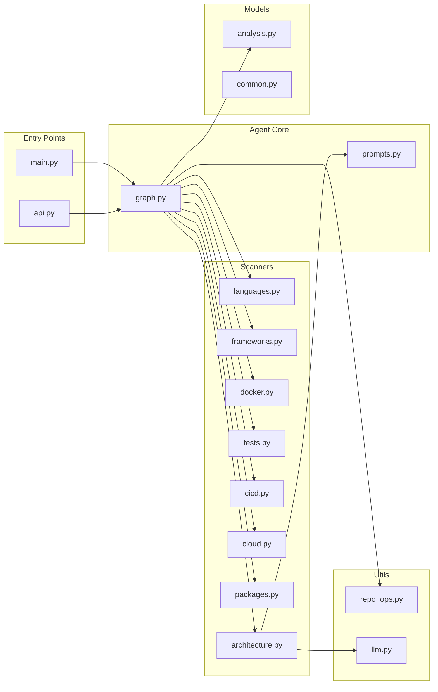
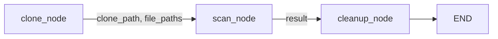
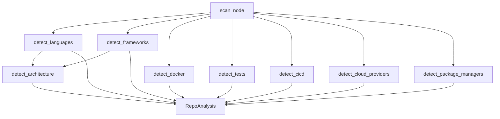
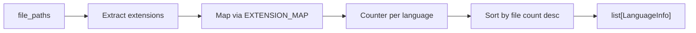
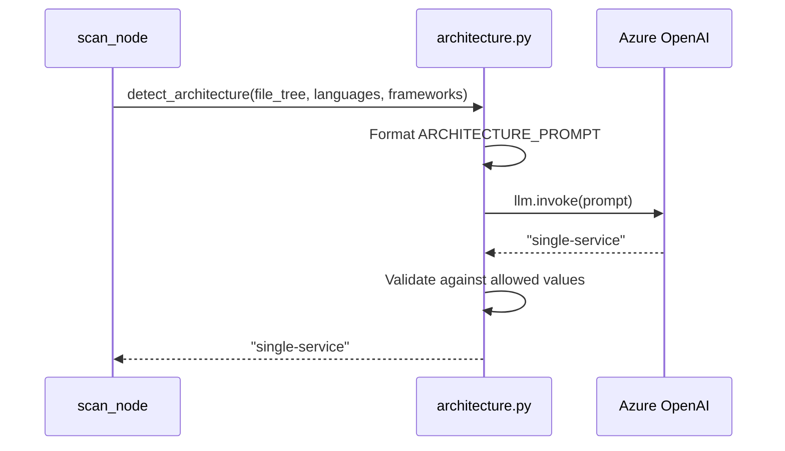
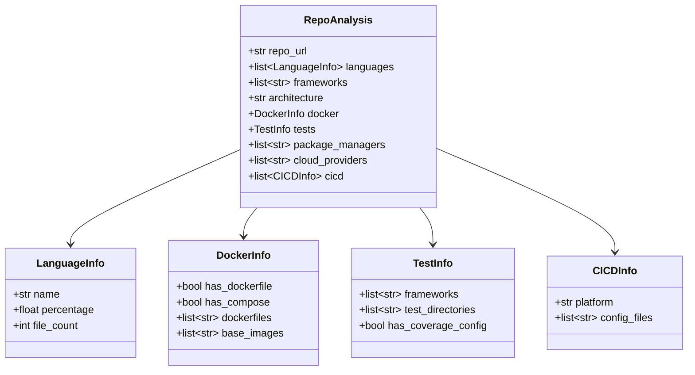
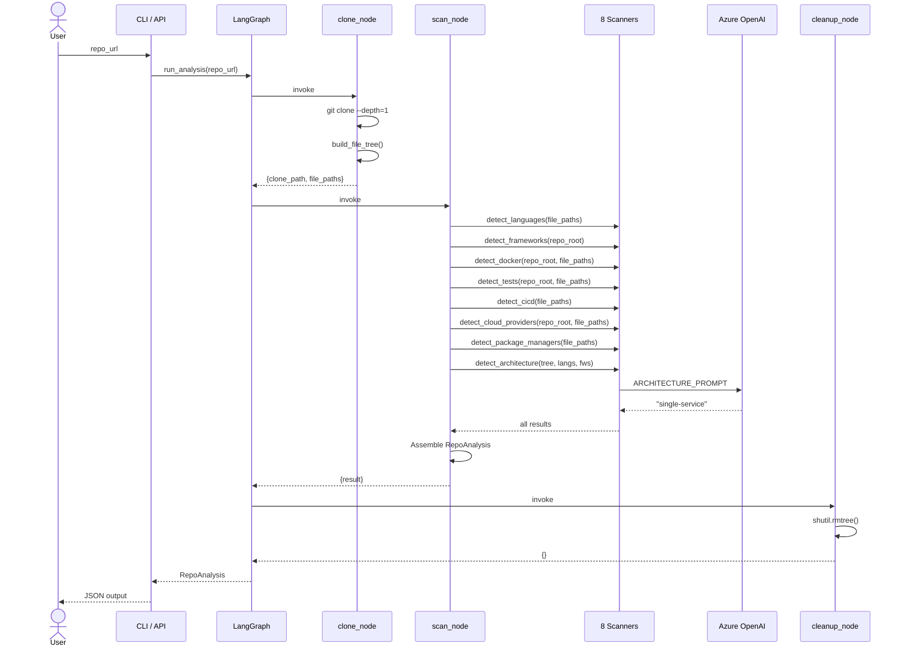

# Agent 1: Code Analyser

## Purpose

The **Code Analyser** is the first agent in the DevOps Guardian multi-agent platform. Its job is to perform a comprehensive, automated audit of any GitHub repository and produce a structured JSON report describing the repository's technology stack, architecture, DevOps tooling, and testing posture.

Think of it as an "X-ray" for repositories — given only a GitHub URL, it clones the repo, scans every relevant file, classifies the architecture with an LLM, and returns a single `RepoAnalysis` object that downstream agents can consume.

### What problems does it solve?

- **Manual repo onboarding is slow**: Engineers joining a new project spend hours figuring out what languages, frameworks, CI/CD pipelines, and cloud providers are in play.
- **Inconsistent audits**: Different people notice different things. This agent applies a deterministic set of scanners plus an LLM-assisted architecture classifier for consistent results.
- **Foundation for downstream agents**: The structured output feeds into subsequent agents (security analyser, deployment recommender, etc.) in the DevOps Guardian pipeline.

---

## High-Level Control Flow



---

## Input & Output

### Input

A single **GitHub repository HTTPS URL**, e.g.:

```
https://github.com/fastapi/fastapi
```

Provided via:

| Channel | Command / Endpoint |
|---|---|
| **CLI** | `devops-guardian analyse <repo_url>` |
| **REST API** | `POST /api/analyse` with body `{ "repo_url": "https://..." }` |

### Output

A structured **`RepoAnalysis`** JSON object:

```json
{
  "repo_url": "https://github.com/fastapi/fastapi",
  "languages": [
    { "name": "Python", "percentage": 92.3, "file_count": 120 },
    { "name": "Shell", "percentage": 7.7, "file_count": 10 }
  ],
  "frameworks": ["FastAPI", "Starlette"],
  "architecture": "single-service",
  "docker": {
    "has_dockerfile": true,
    "has_compose": false,
    "dockerfiles": ["Dockerfile"],
    "base_images": ["python:3.11-slim"]
  },
  "tests": {
    "frameworks": ["pytest"],
    "test_directories": ["tests"],
    "has_coverage_config": true
  },
  "package_managers": ["pip", "Poetry"],
  "cloud_providers": [],
  "cicd": [
    {
      "platform": "GitHub Actions",
      "config_files": [".github/workflows/ci.yml"]
    }
  ]
}
```

---

## Detailed Architecture & Codebase Walkthrough

### File Map



---

### 1. Entry Points

#### `main.py` — CLI (Typer)

| What it does | How |
|---|---|
| Provides the `analyse` CLI command | Uses [Typer](https://typer.tiangolo.com/) to define `devops-guardian analyse <repo_url>` |
| Calls `run_analysis(repo_url)` | Delegates entirely to the LangGraph pipeline in `graph.py` |
| Pretty-prints the JSON result | Uses [Rich](https://rich.readthedocs.io/) `Syntax` with Monokai theme |

#### `api.py` — REST API (FastAPI)

| What it does | How |
|---|---|
| Exposes `POST /api/analyse` | Accepts `{ "repo_url": "<url>" }` validated by Pydantic (`HttpUrl`) |
| Runs analysis in a thread | Uses `asyncio.to_thread(run_analysis, ...)` to avoid blocking the event loop |
| Returns `RepoAnalysis` JSON | FastAPI auto-serialises the Pydantic model as the response |

---

### 2. The LangGraph Pipeline (`graph.py`)

This is the **heart** of the agent. It defines a three-node linear state graph using [LangGraph](https://langchain-ai.github.io/langgraph/).

#### State Schema

```python
class AnalyserState(TypedDict):
    repo_url: str        # Input — the GitHub URL
    clone_path: str      # Set by clone_node — local filesystem path
    file_paths: list[str]  # Set by clone_node — all relative file paths in the repo
    result: dict[str, Any] # Set by scan_node — the final RepoAnalysis dict
```

#### Graph Nodes



##### Node 1: `clone_node`

**Purpose**: Clone the repository to a temporary directory and build a file tree.

- Calls `clone_repo(repo_url)` → performs a **shallow clone** (`--depth=1`) into a temp directory.
- Calls `build_file_tree(clone_path)` → walks the directory (max depth 4), skipping `.git`, `node_modules`, `__pycache__`, `.venv`, `vendor`, `dist`.
- Returns `{ clone_path, file_paths }` into the state.

##### Node 2: `scan_node`

**Purpose**: Run **all 8 scanners** against the cloned repo and assemble the `RepoAnalysis`.

This node calls each scanner function, collects results, and constructs the final Pydantic model:



The architecture scanner is called **last** because it depends on the output of `detect_languages` and `detect_frameworks`.

Returns `{ result: RepoAnalysis.model_dump() }` into the state.

##### Node 3: `cleanup_node`

**Purpose**: Delete the cloned repo from the filesystem.

- Calls `cleanup_repo(clone_path)` → `shutil.rmtree()` on the temp directory.

#### `run_analysis()` — Public Entry Function

```python
def run_analysis(repo_url: str) -> RepoAnalysis:
    graph = build_graph()
    app = graph.compile()
    final_state = app.invoke({...})
    return RepoAnalysis(**final_state["result"])
```

Builds the graph, compiles it, invokes it with the repo URL, and returns the typed result.

---

### 3. Scanners (The Detection Engine)

All scanners live in `agents/code_analyser/scanners/`. Each is a pure function that takes file paths and/or the repo root and returns structured data.

#### Scanner Overview

| Scanner | File | Input | Output | Detection Method |
|---|---|---|---|---|
| **Languages** | `languages.py` | `file_paths` | `list[LanguageInfo]` | Counts files by extension using a 30+ language extension map |
| **Frameworks** | `frameworks.py` | `repo_root` | `list[str]` | Parses `requirements.txt`, `pyproject.toml`, `package.json`, `pom.xml`, `build.gradle` for known framework dependencies |
| **Docker** | `docker.py` | `repo_root`, `file_paths` | `DockerInfo` | Finds Dockerfiles, docker-compose files, extracts base images via regex (`FROM <image>`) |
| **Tests** | `tests.py` | `repo_root`, `file_paths` | `TestInfo` | Detects test dirs (`tests/`, `spec/`, etc.), test frameworks from deps, coverage config files |
| **CI/CD** | `cicd.py` | `file_paths` | `list[CICDInfo]` | Matches file paths against known patterns (`.github/workflows/`, `Jenkinsfile`, `.gitlab-ci.yml`, etc.) for 10 CI/CD platforms |
| **Cloud** | `cloud.py` | `repo_root`, `file_paths` | `list[str]` | Checks file paths and dependency files for AWS/Azure/GCP markers |
| **Packages** | `packages.py` | `file_paths` | `list[str]` | Matches lockfile names (`package-lock.json`, `poetry.lock`, `Cargo.lock`, etc.) against a 20+ manager map |
| **Architecture** | `architecture.py` | `file_tree`, `languages`, `frameworks` | `Literal[...]` | **LLM-powered** — sends a prompt to Azure OpenAI to classify as monorepo / microservices / single-service / monolith |

#### Deep Dive: `languages.py`



- Maintains a map of **30+ file extensions** → language names (`.py` → Python, `.ts`/`.tsx` → TypeScript, etc.).
- Ignores config/data extensions (`.json`, `.yaml`, `.md`, `.lock`, etc.).
- Returns each language with its **name**, **percentage** of total code files, and **file count**.

#### Deep Dive: `frameworks.py`

Runs three sub-detectors in sequence:

1. **Python** (`_detect_from_requirements`): Scans `requirements.txt`, `pyproject.toml` for deps like `django`, `fastapi`, `flask`, etc.
2. **JavaScript/TypeScript** (`_detect_from_package_json`): Parses `package.json` `dependencies` + `devDependencies` for `react`, `next`, `express`, `angular`, etc.
3. **Java** (`_detect_from_java`): Checks `pom.xml` / `build.gradle` for `spring-boot`, `quarkus`, `micronaut`.

Returns the **union** of all detected frameworks, sorted alphabetically.

#### Deep Dive: `architecture.py` (LLM-Powered)

This is the **only scanner that uses an LLM**.



- Formats a prompt (`prompts.py`) containing the directory tree (first 80 paths), detected languages, and frameworks.
- Asks the LLM to classify into exactly one of: `monorepo`, `microservices`, `single-service`, `monolith`.
- Falls back to `"unknown"` if the LLM response doesn't match any valid option.

#### Deep Dive: `cicd.py`

Supports **10 CI/CD platforms**:

| Platform | Matched Pattern |
|---|---|
| GitHub Actions | `.github/workflows/` |
| Jenkins | `Jenkinsfile` |
| GitLab CI | `.gitlab-ci.yml` |
| CircleCI | `.circleci/config.yml` |
| Azure Pipelines | `azure-pipelines.yml` |
| Bitbucket Pipelines | `bitbucket-pipelines.yml` |
| Travis CI | `.travis.yml` |
| Drone CI | `.drone.yml` |
| Tekton | `.tekton/` |
| ArgoCD | `argocd/`, `argo-cd/` |

For directory patterns (ending with `/`), it checks if any file path starts with or contains that prefix. For file patterns, it matches the exact filename.

---

### 4. Data Models (`models/analysis.py`)

All scanner outputs are assembled into Pydantic models:



---

### 5. Utilities

#### `repo_ops.py`

| Function | Purpose |
|---|---|
| `clone_repo(url)` | Shallow-clones (`--depth=1`) into a temp dir under `/tmp/devops_guardian_*/repo` |
| `build_file_tree(root)` | Walks the repo up to depth 4, skipping `.git`, `node_modules`, `__pycache__`, `.venv`, `vendor`, `dist`. Returns sorted relative paths |
| `cleanup_repo(path)` | Removes the cloned directory via `shutil.rmtree` |

#### `llm.py`

| Function | Purpose |
|---|---|
| `get_llm()` | Returns an `AzureChatOpenAI` instance configured from environment variables (`AZURE_OPENAI_DEPLOYMENT`, `AZURE_OPENAI_ENDPOINT`, `AZURE_OPENAI_API_KEY`) |

---

## End-to-End Flow (Complete)



---

## Environment Variables

| Variable | Required | Description |
|---|---|---|
| `AZURE_OPENAI_DEPLOYMENT` | Yes | Azure OpenAI model deployment name |
| `AZURE_OPENAI_ENDPOINT` | Yes | Azure OpenAI endpoint URL |
| `AZURE_OPENAI_API_KEY` | Yes | Azure OpenAI API key |
| `AZURE_OPENAI_API_VERSION` | No | API version (default: `2024-12-01-preview`) |
