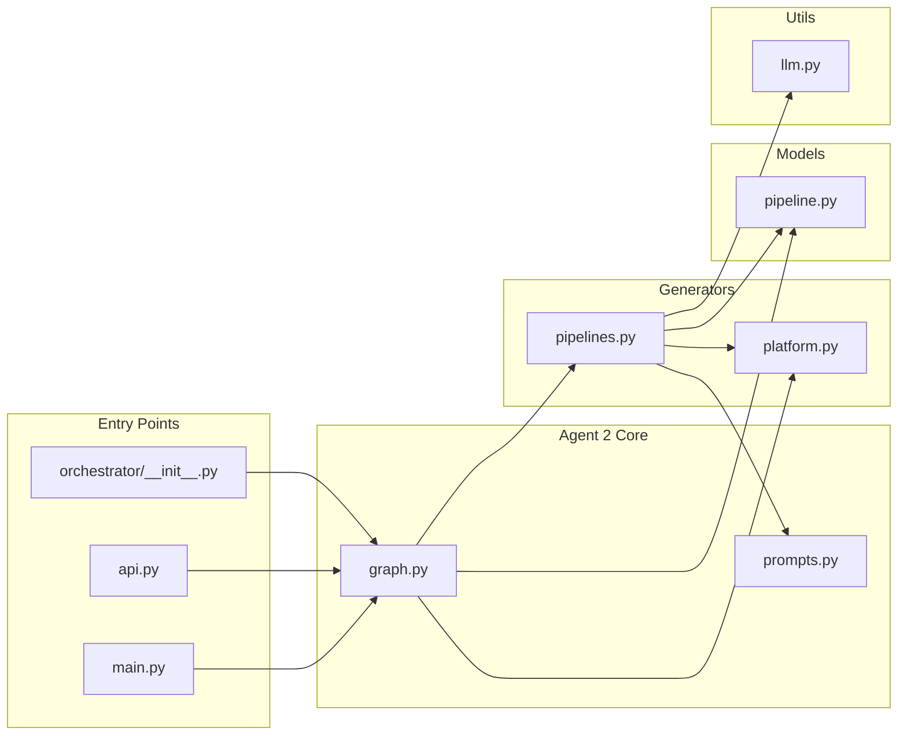
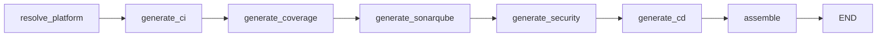
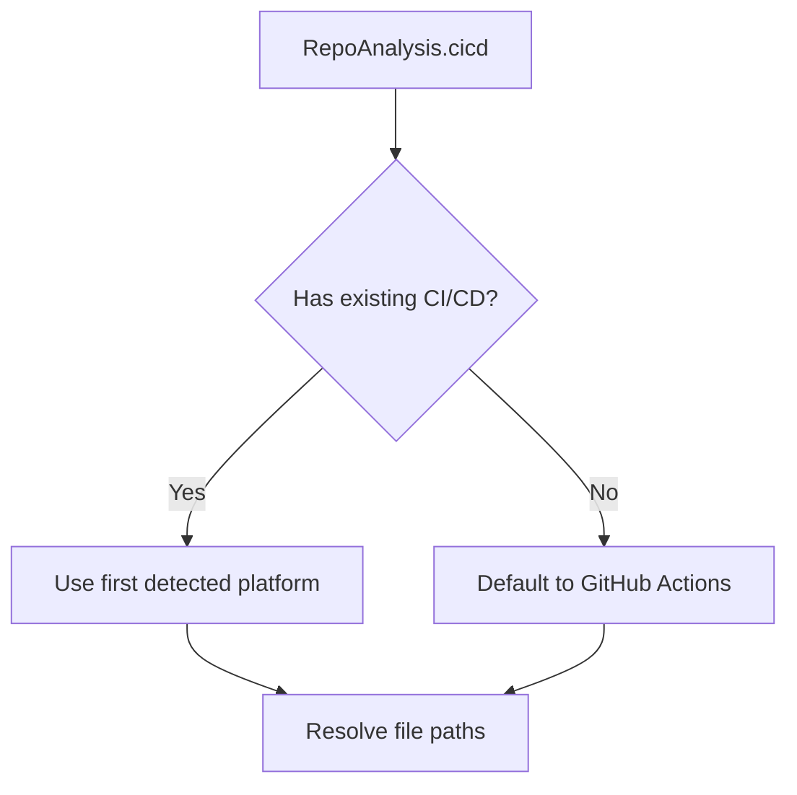
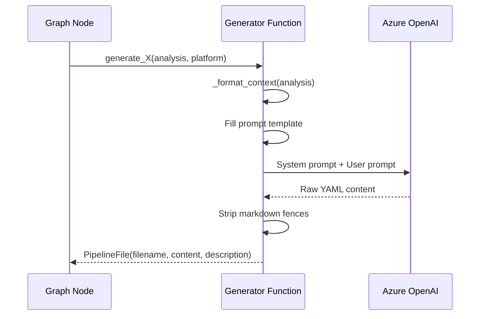
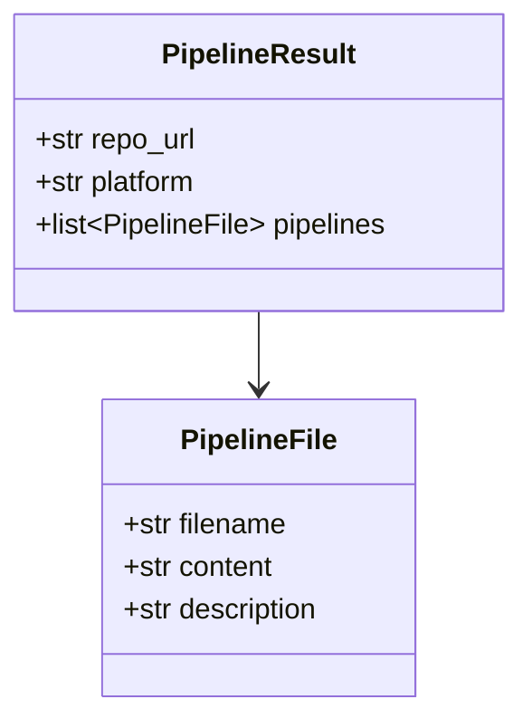
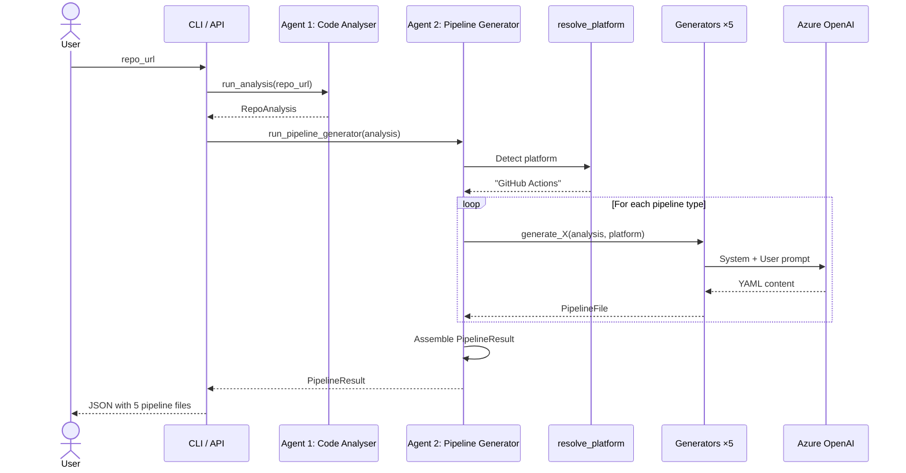

# Agent 2: Pipeline Generator

## Purpose

The **Pipeline Generator** is the second agent in the DevOps Guardian platform. It takes the structured `RepoAnalysis` output from Agent 1 (Code Analyser) and generates a complete set of production-ready CI/CD pipeline configuration files tailored to the repository's technology stack.

It generates **five pipeline types**:

| Pipeline | What it does |
|---|---|
| **CI** | Lint, test, and build on every push/PR |
| **Code Coverage** | Run tests with coverage, upload reports, enforce thresholds |
| **SonarQube** | Static analysis, quality gate integration |
| **Security Scanning** | SAST, dependency scanning, container scanning, secret detection |
| **CD** | Build artifacts, push to registry, deploy to staging & production |

All pipelines are generated as valid YAML for the target CI/CD platform (auto-detected or defaulting to GitHub Actions).

---

## High-Level Control Flow

```mermaid
flowchart TD
    A[RepoAnalysis from Agent 1] --> B[Pipeline Generator Agent]

    subgraph Agent 2 — LangGraph Pipeline
        B --> C[resolve_platform_node]
        C --> D[generate_ci_node]
        D --> E[generate_coverage_node]
        E --> F[generate_sonarqube_node]
        F --> G[generate_security_node]
        G --> H[generate_cd_node]
        H --> I[assemble_node]
    end

    I --> J[PipelineResult]
```

---

## Input & Output

### Input

The **`RepoAnalysis`** object produced by Agent 1. This provides:

- Languages, frameworks, package managers
- Docker configuration (Dockerfiles, base images, compose)
- Test frameworks and directories
- Existing CI/CD platforms detected
- Cloud providers
- Architecture style

### Output

A **`PipelineResult`** object containing all generated pipeline files:

```json
{
  "repo_url": "https://github.com/example/app",
  "platform": "GitHub Actions",
  "pipelines": [
    {
      "filename": ".github/workflows/ci.yml",
      "content": "name: CI\non:\n  push:\n    branches: [main]\n  ...",
      "description": "CI pipeline — lint, test, build"
    },
    {
      "filename": ".github/workflows/coverage.yml",
      "content": "...",
      "description": "Code coverage collection and reporting"
    },
    {
      "filename": ".github/workflows/sonarqube.yml",
      "content": "...",
      "description": "SonarQube static analysis and quality gate"
    },
    {
      "filename": ".github/workflows/security.yml",
      "content": "...",
      "description": "Security scanning — SAST, SCA, container scan, secret detection"
    },
    {
      "filename": ".github/workflows/cd.yml",
      "content": "...",
      "description": "CD pipeline — build, push, deploy with staging & production"
    }
  ]
}
```

---

## How to Use

### CLI

```bash
# Run Agent 1 + Agent 2 together
devops-guardian generate-pipelines https://github.com/org/repo
```

### REST API

```bash
curl -X POST http://localhost:8001/api/generate-pipelines \
  -H "Content-Type: application/json" \
  -d '{"repo_url": "https://github.com/org/repo"}'
```

### Full Pipeline (Orchestrator)

```bash
# Runs ALL agents (currently Agent 1 → Agent 2)
devops-guardian run https://github.com/org/repo
```

---

## Detailed Architecture & Codebase Walkthrough

### File Map



---

### 1. Entry Points

#### `main.py` — CLI command `generate-pipelines`

1. Calls `run_analysis(repo_url)` → gets `RepoAnalysis` from Agent 1.
2. Calls `run_pipeline_generator(analysis)` → passes it to Agent 2.
3. Pretty-prints the resulting JSON.

#### `api.py` — REST endpoint `POST /api/generate-pipelines`

1. Accepts `{ "repo_url": "<url>" }`.
2. Runs Agent 1 then Agent 2 in a background thread.
3. Returns the `PipelineResult` JSON.

#### `orchestrator/__init__.py` — Full pipeline

Chains `analyse_node → pipeline_node → END` so that `devops-guardian run` executes both agents automatically.

---

### 2. The LangGraph Pipeline (`graph.py`)

A **seven-node sequential graph** that builds up the list of pipelines one by one.

#### State Schema

```python
class PipelineState(TypedDict):
    analysis: dict[str, Any]   # The RepoAnalysis from Agent 1
    platform: str              # Resolved CI/CD platform name
    pipelines: list[dict]      # Accumulated pipeline files
    result: dict[str, Any]     # Final PipelineResult
```

#### Graph Flow



| Node | Purpose | State mutation |
|---|---|---|
| `resolve_platform` | Pick the CI/CD platform (from existing config or default GitHub Actions) | Sets `platform` |
| `generate_ci` | Generate the CI pipeline via LLM | Appends to `pipelines` |
| `generate_coverage` | Generate the coverage pipeline via LLM | Appends to `pipelines` |
| `generate_sonarqube` | Generate the SonarQube pipeline via LLM | Appends to `pipelines` |
| `generate_security` | Generate the security scanning pipeline via LLM | Appends to `pipelines` |
| `generate_cd` | Generate the CD pipeline via LLM | Appends to `pipelines` |
| `assemble` | Wrap everything into a `PipelineResult` | Sets `result` |

---

### 3. Platform Resolution (`generators/platform.py`)



**Supported platforms and their file conventions:**

| Platform | Workflow directory | File naming |
|---|---|---|
| GitHub Actions | `.github/workflows/` | `{name}.yml` |
| GitLab CI | root | `.gitlab-ci.yml` |
| Azure Pipelines | root | `azure-pipelines.yml` |
| Jenkins | root | `Jenkinsfile` |
| CircleCI | `.circleci/` | `config.yml` |
| Bitbucket Pipelines | root | `bitbucket-pipelines.yml` |

---

### 4. Pipeline Generators (`generators/pipelines.py`)

Each generator follows the same pattern:



#### `_format_context(analysis)`

Extracts all relevant fields from `RepoAnalysis` into a flat dict of template variables:

| Variable | Source |
|---|---|
| `languages` | `analysis.languages[*].name` |
| `frameworks` | `analysis.frameworks` |
| `package_managers` | `analysis.package_managers` |
| `architecture` | `analysis.architecture` |
| `has_dockerfile` | `analysis.docker.has_dockerfile` |
| `base_images` | `analysis.docker.base_images` |
| `test_frameworks` | `analysis.tests.frameworks` |
| `test_directories` | `analysis.tests.test_directories` |
| `has_coverage_config` | `analysis.tests.has_coverage_config` |
| `cloud_providers` | `analysis.cloud_providers` |

#### Generator Functions

| Function | Prompt Used | Output File (GitHub Actions) | What the LLM generates |
|---|---|---|---|
| `generate_ci` | `CI_PIPELINE_PROMPT` | `.github/workflows/ci.yml` | Dependency install, lint, test, build with caching |
| `generate_coverage` | `COVERAGE_PIPELINE_PROMPT` | `.github/workflows/coverage.yml` | Tests with coverage, report upload, 80% threshold |
| `generate_sonarqube` | `SONARQUBE_PIPELINE_PROMPT` | `.github/workflows/sonarqube.yml` | Build, test with coverage, sonar-scanner, quality gate |
| `generate_security` | `SECURITY_PIPELINE_PROMPT` | `.github/workflows/security.yml` | SAST, SCA, container scan, secret detection |
| `generate_cd` | `CD_PIPELINE_PROMPT` | `.github/workflows/cd.yml` | Build, push to registry, staging + production deploy |

---

### 5. Prompts (`prompts.py`)

Each prompt is a carefully structured template that:

1. Tells the LLM which **platform** to target.
2. Provides the full **repository analysis** context.
3. Lists specific **requirements** for what the pipeline must include.
4. Ends with: `Output ONLY the YAML content for the pipeline file.`

A system prompt enforces YAML-only output:

> *"You are a senior DevOps engineer. You generate production-ready CI/CD pipeline configuration files. Output ONLY valid YAML — no markdown fences, no explanations, no extra text."*

#### What each prompt requests:

| Prompt | Key requirements |
|---|---|
| **CI** | Install deps, lint, test, build, caching, trigger on push/PR |
| **Coverage** | Tests with coverage, HTML/XML report, artifact upload, 80% threshold |
| **SonarQube** | Build + test with coverage, sonar-scanner, secrets for SONAR_HOST_URL/TOKEN, quality gate check |
| **Security** | SAST (Semgrep/CodeQL/Bandit), SCA (Trivy/npm audit/pip-audit), container scan, Gitleaks, fail on HIGH/CRITICAL |
| **CD** | Trigger on main only, build + tag artifact, push to registry, staging + production with manual approval |

---

### 6. Data Models (`models/pipeline.py`)



---

## End-to-End Flow (Complete)



---

## Environment Variables

| Variable | Required | Description |
|---|---|---|
| `AZURE_OPENAI_API_KEY` | Yes | Azure OpenAI API key |
| `AZURE_OPENAI_ENDPOINT` | Yes | Azure OpenAI endpoint URL |
| `AZURE_OPENAI_DEPLOYMENT` | Yes | Azure OpenAI model deployment name |
| `AZURE_OPENAI_API_VERSION` | No | API version (default: `2024-12-01-preview`) |
| `GITHUB_TOKEN` | No | GitHub PAT for private repository access |
